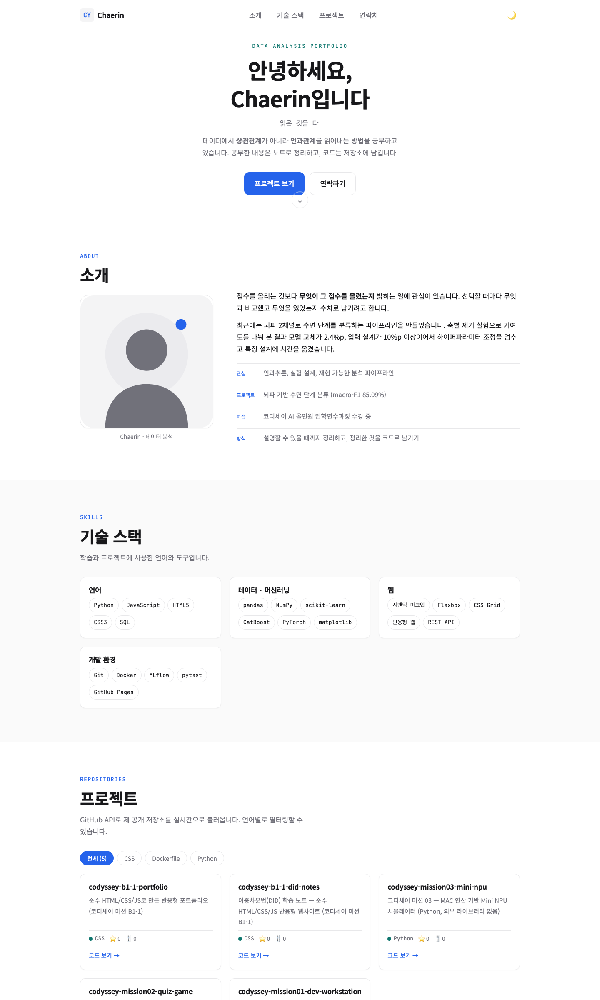
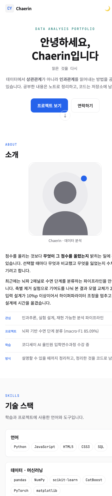
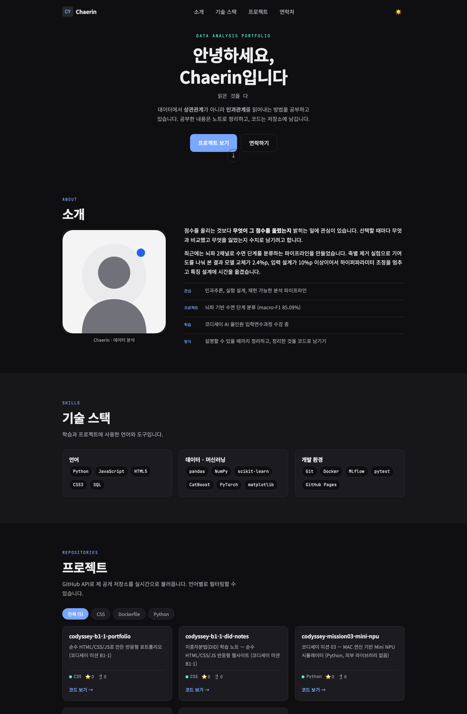

# Chaerin | 데이터 분석 포트폴리오

외부 라이브러리 없이 **순수 HTML / CSS / JavaScript**로 만든 반응형 포트폴리오 사이트입니다.
GitHub API로 공개 저장소를 실시간으로 불러와 프로젝트 목록을 구성합니다.

> 코디세이 AI 올인원 입학연수과정 미션 B1-1

**배포 URL** https://clumsyorca.github.io/codyssey-b1-1-portfolio/

| 데스크톱 | 모바일 | 다크 모드 |
|---|---|---|
|  |  |  |

### 사용 기술

HTML5 시맨틱 마크업 · CSS3 (사용자 정의 속성, Flexbox, Grid, 미디어 쿼리) ·
Vanilla JavaScript (ES6+, `fetch`, `IntersectionObserver`, `localStorage`) ·
GitHub REST API · Google Fonts · GitHub Pages

React / Vue / jQuery / Bootstrap / Tailwind 등 **외부 프레임워크는 사용하지 않았습니다.**

---

## 시작하기

```bash
git clone https://github.com/clumsyorca/codyssey-b1-1-portfolio.git
cd codyssey-b1-1-portfolio
```

VS Code에서 `index.html` 우클릭 → **Open with Live Server**.
Live Server가 없다면 `python3 -m http.server 8000` 후 `http://localhost:8000` 접속.

> `file://`로 직접 열면 GitHub API 호출이 브라우저 보안 정책에 막힐 수 있으므로
> 반드시 로컬 서버(`http://`)로 실행하세요.

## 폴더 구조

```
.
├── index.html          단일 페이지 (모든 섹션)
├── css/style.css       스타일 전부 (26개 구획으로 주석 구분)
├── js/main.js          상태 · DOM 조작 · API · 폼 검증
├── images/             프로필 일러스트, 파비콘
├── docs/screenshots/   제출용 스크린샷
└── README.md
```

역할별로 파일을 하나씩 두었습니다. 이 규모에서는 파일을 잘게 나누면 요청 수가 늘고
어디에 무엇이 있는지 찾아다녀야 해서, 대신 **파일 안에서 주석으로 구획에 번호를 매겨**
탐색할 수 있게 했습니다.

---

# 구현 기능

과제 요구사항 순서대로 정리했습니다. 각 링크를 누르면 해당 코드로 이동합니다.

## 1. HTML 구조 (시맨틱 마크업)

> 요구: div로만 감싸지 않고 `header` `nav` `main` `section` `article` `footer`를 사용한다

[헤더와 내비게이션 (L18-L47)](index.html#L18-L47) ·
[문의 폼 (L204-L225)](index.html#L204-L225)

시맨틱 태그는 **이름이 내용의 역할을 설명하는 태그**입니다. `div`는 의미가 없는 상자이고
`nav`는 "내비게이션이다"라는 의미를 담습니다. 화면 출력은 같지만 스크린 리더가 영역을
건너뛸 수 있고, 검색엔진이 문서 구조를 파악하며, 코드만 봐도 구조가 읽힙니다.

**태그를 먼저 정하고 내용을 채운 것이 아니라, 내용의 역할에 맞는 이름을 붙였습니다.**
상단의 로고와 메뉴는 머리말이라 `header`, 그 안의 메뉴 묶음은 `nav`,
주제별 구획은 `section`, 떼어내도 말이 되는 기술 카드와 저장소 카드는 `article`입니다.
반대로 [카드를 담는 상자 (L191)](index.html#L191)는 Grid를 걸기 위한 그릇일 뿐
의미가 없어 `div`로 두었습니다. 없는 의미를 지어내지 않는 것도 시맨틱 마크업의 일부라고 보았습니다.

**함께 챙긴 것**

- [앵커 링크 (L27-L30)](index.html#L27-L30) — `href="#about"`의 값과 `<section id="about">`의 id가 일치해야 이동합니다
- [이미지 alt (L81-L83)](index.html#L81-L83) — 이미지를 볼 수 없을 때 대신 읽히는 대체 텍스트
- [label의 for와 input의 id 매칭 (L206-L207)](index.html#L206-L207) — 연결되면 라벨 글자를 클릭해도 커서가 입력칸으로 이동합니다. 오타가 나도 화면상 차이가 없어 **라벨을 클릭해 확인**하는 것이 검증 방법입니다
- [`<script defer>` (L245)](index.html#L245) — HTML 파싱이 끝난 뒤 실행되므로 `querySelector`가 요소를 안전하게 찾습니다
- [viewport 메타 태그 (L5)](index.html#L5) — 없으면 모바일이 데스크톱 화면을 축소해 보여줘 미디어 쿼리가 무력화됩니다

W3C Nu 검사기 기준 **오류 0건, 경고 0건**입니다.

## 2. CSS 변수와 다크 테마

> 요구: CSS 변수(`:root`)로 색상·폰트·간격을 정의하고, 다크 모드용 변수를 `[data-theme="dark"]`에 별도 정의한다

[라이트 팔레트 (L16-L53)](css/style.css#L16-L53) ·
[다크 팔레트 (L55-L71)](css/style.css#L55-L71)

```css
:root              { --color-bg: #ffffff; --color-text: #18181b; }
[data-theme="dark"]{ --color-bg: #0f0f11; --color-text: #ededf0; }

body { background: var(--color-bg); color: var(--color-text); }
```

**다크 모드의 원리가 여기에 있습니다.** JavaScript가 `<html>`에 `data-theme="dark"` 속성
하나만 붙이면 `[data-theme="dark"]` 규칙이 활성화되어 변수 값이 통째로 교체되고,
`var()`를 쓰는 모든 요소의 색이 한 번에 바뀝니다.
**JS는 속성 하나만 바꾸고 실제 색 변경은 CSS가 전담합니다.**
파일 전체에서 색은 `var()`로만 지정했습니다.

## 3. 레이아웃 (Flexbox와 Grid)

> 요구: 네비게이션은 Flexbox, 카드는 Grid(`auto-fit`, `minmax`)로 구현한다

[헤더 Flexbox (L251-L262)](css/style.css#L251-L262) ·
[프로젝트 카드 Grid (L639-L644)](css/style.css#L639-L644) ·
[기술 스택 Grid (L1048-L1053)](css/style.css#L1048-L1053)

**Flexbox는 1차원, Grid는 2차원입니다.** Flexbox는 한 줄에 나란히 놓는 것만 신경 쓰고,
Grid는 행과 열을 동시에 관리합니다. 판단 기준은 **"세로줄까지 맞아야 하는가"**입니다.
맞아야 하면 Grid, 한 줄 흐름이면 Flex입니다.

```css
.header-inner  { display: flex; justify-content: space-between; align-items: center; }
.projects-grid { display: grid; grid-template-columns: repeat(auto-fit, minmax(280px, 1fr)); }
```

`minmax(280px, 1fr)`은 "각 열은 최소 280px, 여유가 있으면 남은 공간을 균등하게",
`auto-fit`은 "몇 개가 들어가는지는 브라우저가 계산"입니다.
덕분에 **미디어 쿼리를 한 줄도 쓰지 않고** 화면 폭에 따라 3열에서 2열, 1열로 바뀝니다.

둘은 경쟁 관계가 아닙니다. [카드 내부 (L646-L656)](css/style.css#L646-L656)는
제목에서 링크까지 한 방향으로 흐르므로 다시 `flex-direction: column`을 썼고,
설명 문단에 `flex-grow: 1`을 주어 설명 길이가 달라도 하단 메타 영역이 정렬되게 했습니다.

## 4. 반응형 (모바일 퍼스트)

> 요구: 모바일 퍼스트로 작성하고 브레이크포인트는 768px, 1024px.
> 모바일에서 네비게이션이 숨겨지고 햄버거 버튼이 나타난다

[모바일 기본 상태 (L337-L355)](css/style.css#L337-L355) ·
[태블릿 768px (L912-L981)](css/style.css#L912-L981) ·
[데스크톱 1024px (L983-L1013)](css/style.css#L983-L1013)

모바일 스타일을 **기본값**으로 쓰고 `min-width` 미디어 쿼리로 큰 화면 규칙을 **더하는** 방식입니다.
반대 방향(`max-width`로 빼기)보다 코드가 단순해지고 모바일 기기가 처리할 CSS가 줄어듭니다.

```css
.nav-list  { display: none; }   /* 기본 = 모바일 */
.hamburger { display: block; }

@media (min-width: 768px) {
  .nav-list  { display: flex; }
  .hamburger { display: none; }
}
```

시각 효과는 [버튼 (L187-L229)](css/style.css#L187-L229)과
[카드 hover (L658-L662)](css/style.css#L658-L662)에 있습니다.
`transition`은 **변화 전 상태**에 작성해야 마우스를 뗄 때도 애니메이션이 적용됩니다.

## 5. DOM 조작과 이벤트

> 요구: `var` 대신 `const`/`let`, HTML에 `onclick` 대신 `addEventListener`,
> `querySelector`로 선택하고 `classList`로 클래스를 조작한다

[DOM 요소 참조 (L32-L45)](js/main.js#L32-L45) ·
[이벤트 일괄 연결 (L407-L435)](js/main.js#L407-L435)

흐름은 세 단계입니다.

```js
const hamburger = document.querySelector('#hamburger');   // ① 찾아서 담는다
hamburger.addEventListener('click', toggleMenu);          // ② 할 일을 등록한다
                                                          // ③ 클릭되면 그때 실행된다
```

②는 **등록일 뿐 실행이 아닙니다.** 브라우저는 스크립트를 한 번 실행한 뒤 종료되지 않고
대기 상태로 들어가, 사건이 발생할 때마다 등록해 둔 함수를 호출합니다.

`onclick`을 HTML에 쓰지 않은 이유는 구조와 동작이 섞이고, 한 요소에 동작을 여러 개 붙일 수 없으며,
나중에 제거하기도 어렵기 때문입니다. 자주 쓰는 요소는 미리 상수에 담아 반복 탐색을 없앴습니다.

스타일 변경은 `element.style`을 직접 건드리지 않고 **클래스만 붙였다 뗍니다.**
실제 모양은 CSS가 담당합니다.

## 6. 인터랙션

| 기능 | 동작 | 기준값 | 코드 |
|---|---|---|---|
| 햄버거 메뉴 | 메뉴 토글, 버튼이 X자로 변형, 항목 클릭 시 자동 닫힘 | 768px 미만 | [L91-L107](js/main.js#L91-L107) |
| 다크 모드 | 테마 전환 + `localStorage` 저장 → 새로고침 후에도 유지 | - | [L65-L88](js/main.js#L65-L88) |
| 부드러운 스크롤 | 앵커 링크 클릭 시 해당 섹션으로 이동 | - | [CSS L73-L76](css/style.css#L73-L76) |
| 네비게이션 배경 변경 | 스크롤 시 헤더에 배경과 블러 | **60px** | [L112-L129](js/main.js#L112-L129) |
| 스크롤 탑 버튼 | 버튼 등장, 클릭 시 최상단 이동 | **300px** | [L112-L129](js/main.js#L112-L129) |
| 현재 섹션 강조 | 보고 있는 섹션의 메뉴 항목 강조 | 상단 -120px | [L119-L128](js/main.js#L119-L128) |
| 스크롤 애니메이션 | 화면에 들어오면 페이드 인 | `threshold: **0.2**` | [L134-L148](js/main.js#L134-L148) |
| 타이핑 효과 | Hero 문구 순환 (보너스) | - | [L153-L180](js/main.js#L153-L180) |

기준값은 [파일 상단 상수 (L11-L13)](js/main.js#L11-L13)로 분리해 한 곳만 고치면 되게 했습니다.

**다크 모드는 세 조각으로 이루어집니다.** 토글로 상태를 바꾸고, `localStorage`에 저장하고,
**페이지가 열릴 때 저장값을 꺼내 적용**합니다. 세 번째가 빠지면 "토글은 되는데
새로고침하면 풀리는" 상태가 됩니다. 저장값이 없을 때는
[`prefers-color-scheme` (L80-L88)](js/main.js#L80-L88)로 운영체제 설정을 따릅니다. (보너스)

**스크롤 애니메이션**은 `scroll` 이벤트로 위치를 직접 계산하는 대신
[IntersectionObserver (L134-L148)](js/main.js#L134-L148)를 썼습니다.
브라우저가 "요소가 화면에 들어왔는지"를 알려주는 기능이라 성능이 좋고,
한 번 나타난 요소는 `unobserve`로 관찰을 해제합니다.

## 7. ES6+ 문법과 배열 메서드

> 요구: 화살표 함수, 템플릿 리터럴, 구조분해 할당, `map`/`filter`/`forEach`를 활용한다

[카드 생성 함수 (L186-L200)](js/main.js#L186-L200) ·
[필터 적용 (L202-L206)](js/main.js#L202-L206) ·
[map으로 렌더링 (L285)](js/main.js#L285)

```js
const createProjectCard = ({ name, html_url, description, language, stargazers_count }) => `
  <article class="project-card">...</article>
`;

projectsGrid.innerHTML = visible.map(createProjectCard).join('');
```

**구조분해 할당**은 객체에서 필요한 값만 꺼내 변수로 만드는 문법입니다.
GitHub API 응답 하나에는 속성이 80개가 넘는데 카드에 쓰는 것은 6개뿐이라,
매개변수 자리에서 바로 분해해 `repo.`의 반복을 없앴습니다.

**템플릿 리터럴**(백틱)은 여러 줄 문자열과 `${}` 값 삽입을 지원해
HTML 덩어리를 문자열 연결 없이 그대로 쓸 수 있습니다.

**배열 메서드**는 목록의 개수를 몰라도 전체를 한 줄로 처리하기 위해 씁니다.
`map`은 각 항목을 다른 형태로 **변환**하고, `filter`는 조건에 맞는 것만 **선별**하며,
`forEach`는 결과를 남기지 않고 **순회**합니다.

`map`과 `filter`는 **원본을 바꾸지 않고 새 배열을 돌려줍니다.**
덕분에 전체 목록은 `state.projects`에 그대로 두고 화면에는 필터를 통과한 것만 그릴 수 있어,
"전체" 버튼을 눌렀을 때 API를 다시 호출하지 않아도 됩니다.
`map`의 결과는 문자열 배열이므로 `join('')`으로 이어붙인 뒤 화면에 넣습니다.

## 8. 비동기 처리와 API 연동

> 요구: `fetch`와 `async/await`로 GitHub API를 호출하고,
> 로딩 / 성공 / 에러 / 빈 상태를 UI로 표현한다. `try/catch`로 에러를 처리한다

[fetchProjects (L291-L330)](js/main.js#L291-L330) ·
[상태별 렌더링 (L237-L289)](js/main.js#L237-L289)

네트워크 요청은 결과가 오기까지 시간이 걸리므로 그동안 화면이 멈추면 안 됩니다.
그래서 비동기로 처리하고, `await`로 "결과를 기다렸다가 다음 줄로" 진행합니다.
`await`를 쓰려면 함수에 `async`를 붙여야 합니다.

| 상태 | 화면 | 코드 |
|---|---|---|
| 로딩 | 회전 스피너 + "저장소를 불러오는 중" | [L238-L246](js/main.js#L238-L246) |
| 성공 | 저장소 카드 목록 | [L272-L288](js/main.js#L272-L288) |
| 에러 | 사유 문구 + **다시 시도** 버튼 | [L248-L261](js/main.js#L248-L261) |
| 빈 상태 | "표시할 프로젝트가 없습니다" | [L263-L270](js/main.js#L263-L270) |

**가장 주의한 부분은 `if (!response.ok)` 확인입니다.**
`fetch`는 서버가 404나 403을 응답해도 "통신 자체는 성공했다"고 보아 `catch`로 가지 않습니다.
따라서 상태 코드를 직접 확인하고 `throw`로 에러를 만들어 던져야 합니다.
이 처리를 빼면 아이디를 잘못 써도 에러 UI가 뜨지 않습니다.

비인증 호출은 **시간당 60회** 제한이 있어 초과 시 `403`이 오는데,
이때 재시도 버튼이 있는 에러 화면이 표시됩니다.
[재시도 버튼 (L260)](js/main.js#L260)은 동적으로 생성한 요소이므로
**만든 직후에** 이벤트를 연결했습니다.

**보너스 — 언어별 필터링**: [필터 바 (L208-L235)](js/main.js#L208-L235)에서
불러온 데이터의 언어 목록을 추출해 버튼을 동적으로 만들고, `filter`로 목록을 좁힙니다.

## 9. 폼 유효성 검사

> 요구: 필수값과 이메일 형식을 검증하고 에러 메시지를 입력 필드 근처에 표시한다.
> `event.preventDefault()`로 기본 동작을 방지하고 성공 메시지를 표시한다

[검증 로직 (L334-L404)](js/main.js#L334-L404) · [폼 마크업 (L204-L225)](index.html#L204-L225)

| 필드 | 규칙 |
|---|---|
| 이름 | 공백 제외 필수 |
| 이메일 | 필수 + 형식 검사 `/^[^\s@]+@[^\s@]+\.[^\s@]+$/` |
| 메시지 | 필수 + 10자 이상 |

폼에 [`novalidate` (L204)](index.html#L204)를 붙인 것이 핵심입니다.
이것이 없으면 브라우저가 자기 방식대로 경고 풍선을 띄우고 제출을 막아,
직접 만든 검증 코드가 실행될 기회조차 없습니다. 요구사항인
"에러 메시지를 입력 필드 근처에 표시"는 브라우저 기본 풍선으로는 만들 수 없습니다.

에러 문단은 [HTML에 미리 빈 자리로](index.html#L208) 두고 글자만 채웁니다.
실행 중에 요소를 새로 만들어 넣으면 에러가 뜰 때마다 레이아웃이 밀리기 때문입니다.
한 번 에러가 표시된 필드는 `input` 이벤트로 **입력 중 실시간 재검증**합니다.

## 10. 상태 관리 패턴

> 요구: "사용자 이벤트 → 상태 변경 → 화면 업데이트" 흐름이 명확해야 하며,
> 3가지 이상의 상태-렌더링 흐름이 존재해야 한다

[state 객체 (L22-L29)](js/main.js#L22-L29)

화면을 직접 조작하는 대신, **상태 객체를 바꾸고 렌더 함수를 호출하는** 구조로 작성했습니다.

```js
const state = {
  theme: 'light',      // 'light' | 'dark'
  isMenuOpen: false,
  status: 'idle',      // 'idle' | 'loading' | 'success' | 'error' | 'empty'
  projects: [],
  filter: 'all',
};
```

| 이벤트 | 상태 변경 | 렌더링 | 코드 |
|---|---|---|---|
| 테마 버튼 click | `state.theme` | `data-theme` 속성 → CSS 변수 교체 → 전체 색상 | [L65-L78](js/main.js#L65-L78) |
| 페이지 로드 / 재시도 click | `state.status`, `state.projects` | 스피너 / 카드 / 에러 / 빈 안내 | [L237-L330](js/main.js#L237-L330) |
| 폼 submit | 필드별 검증 결과 | 에러 메시지 표시와 숨김 | [L383-L404](js/main.js#L383-L404) |
| 햄버거 click | `state.isMenuOpen` | `.active` 클래스 토글 + `aria-expanded` 갱신 | [L91-L101](js/main.js#L91-L101) |
| 필터 버튼 click | `state.filter` | `filter()` 결과만 다시 렌더 | [L228-L234](js/main.js#L228-L234) |

이 구조의 이점은 **화면을 확인하지 않아도 상태만 보면 화면을 알 수 있다**는 점입니다.
콘솔에 `state`를 입력하면 지금 화면이 어떤 모습인지 그대로 드러납니다.
버그가 생겼을 때도 상태가 틀린 것인지 그리는 코드가 틀린 것인지 바로 구분됩니다.

또한 클릭할 때와 페이지를 처음 열 때가 **같은 렌더 함수**를 사용하므로 로직이 한 벌만 존재합니다.
이벤트 핸들러는 상태를 바꾸고, 렌더 함수는 상태를 읽어 그립니다.

## 11. 배포

GitHub Pages로 배포했습니다. Settings → Pages → Branch `main` / `(root)`.

정적 사이트라 서버가 필요 없고, 데이터가 필요한 부분은 **브라우저가 직접 GitHub API를 호출**해
해결합니다. 경로는 모두 상대 경로(`css/style.css`)로 작성했습니다.
절대 경로(`/css/style.css`)를 쓰면 저장소 이름이 하위 경로로 붙는 GitHub Pages에서 깨집니다.

---

## 접근성

- 모든 이미지에 의미 있는 `alt`, 인라인 SVG에 `role="img"`와 `aria-label`
- 폼 `label`의 `for`와 입력 요소의 `id`를 1:1 연결
- 햄버거 버튼에 `aria-expanded` / `aria-controls`, 상태 변화 시 값과 `aria-label` 갱신
- API 결과 영역에 `aria-live="polite"`, 에러 메시지에 `role="alert"`
- 타이핑 효과는 `aria-hidden`으로 감추고 대신 읽을 문장을 `.sr-only`로 제공
- [`prefers-reduced-motion` (L1015-L1034)](css/style.css#L1015-L1034) 설정 시 애니메이션 최소화

## 보안

- API 응답을 `innerHTML`에 넣기 전 [`escapeHtml()` (L52-L60)](js/main.js#L52-L60)로 특수문자 이스케이프 (XSS 방지)
- 외부 링크에 `rel="noopener noreferrer"`
- 인증 토큰을 코드에 포함하지 않음 (공개 저장소에 그대로 노출되므로)

## 트러블슈팅

**1. 개발 중 GitHub API 403 응답**
Live Server가 저장할 때마다 새로고침하면서 시간당 60회 한도를 소진했습니다.
응답을 로컬 JSON으로 저장해 UI를 먼저 완성하고 마지막에 실제 호출로 전환했습니다.
한도 초과 시 에러 UI가 뜨는 것은 요구사항에 부합하는 정상 동작입니다.

**2. 스크롤 탑 버튼에 전환 효과가 적용되지 않음**
`display: none`은 `transition` 대상이 아닙니다.
`opacity`와 `visibility`를 함께 쓰는 방식으로 바꿔 부드럽게 나타나게 했습니다.

**3. 동적으로 만든 재시도 버튼이 동작하지 않음**
페이지 로드 시점에 존재하지 않는 요소라 이벤트가 붙지 않았습니다.
`innerHTML`로 버튼을 생성한 **직후에** `addEventListener`를 연결해 해결했습니다.

## 참고

- [MDN Web Docs](https://developer.mozilla.org/ko/)
- [GitHub REST API: Repositories](https://docs.github.com/en/rest/repos/repos)
